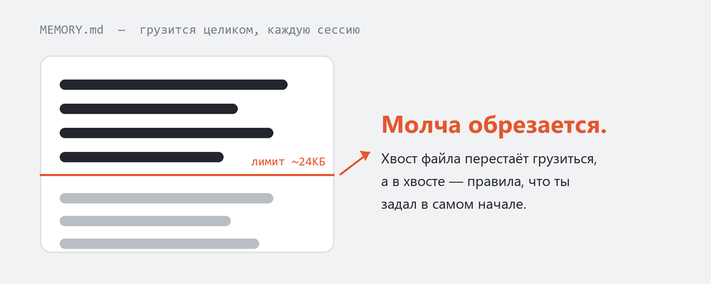

<p align="center">
  
</p>

<h1 align="center">memory-maintain</h1>

<p align="center">
  <em>Claude Code молча забывает твои самые первые правила. Это чинит — ничего не удаляя.</em>
</p>

<p align="center">
  
  
  
  
  
</p>

<p align="center">
  <strong>Держит MEMORY.md в лимите загрузки &middot; без потерь &middot; ничего никогда не удаляется</strong><br>
  <sub>Claude Code грузит <code>MEMORY.md</code> целиком в каждую сессию под жёстким байтовым лимитом (~24КБ в проекте, где это нашлось; цифра наблюдаемая, а не задокументированная Anthropic). Всё, что за лимитом, молча обрезается с конца файла — а там обычно лежат постоянные правила и справочные факты. Скилл держит индекс маленьким, а всё остальное переносит в topic-файлы, до которых recall всё равно дотягивается. Проверено RED/GREEN-тестом на копии реального 160КБ-индекса из прода (261 запись). <a href="#числа">Числа</a> &middot; <a href="#как-это-работает">как это работает</a>.</sub>
</p>

<p align="center">
  <sub><a href="README.md">English</a> &middot; <strong>Русский</strong></sub>
</p>

---

Память Claude Code двухуровневая. `MEMORY.md` — это **индекс**, который грузится целиком в каждую сессию. Topic-файлы (`project_*.md`, `feedback_*.md`, `reference_*.md`) хранят сами знания и возвращаются через recall независимо от размера индекса. У индекса есть байтовый лимит, у topic-файлов — нет.

Без присмотра индекс только растёт: новая память пишется жирной строкой, апдейт дописывается к существующей строке, ничего не архивируется. Как только он за лимитом, **самые старые** записи в конце выпадают из каждой сессии — молча, без ошибки. Это обычно те правила, что ты задал в самый первый день. Вот почему агент снова и снова делает то, что ты запрещал.

memory-maintain чинит саму привычку записи и сжимает индекс без потерь, когда тот раздувается.

<p align="center">
  
</p>

## Было / стало

Агент, которого просят «быстро сохрани факт», без скилла пишет весь инцидент прямо в строку индекса:

```
- **[Stripe double-credit bug 2026-07-03: invoice.paid webhooks within 2s double-apply
  period_reset_at, ~14 users, root cause missing idempotency key in billing/webhooks.py:212,
  mitigated with a 5s Redis lock, permanent fix = unique constraint (user_id, period_start),
  monitored in dashboard 41](project_billing_dup_2026_07_03.md)**
```

Эта одна строка — **332 байта**, и каждый факт в ней теперь заложник лимита. (В тесте ниже агент под давлением времени доводил такие строки до **2069 байт**.) Со скиллом детали уходят в файл, а индекс держит один короткий указатель:

```
- [Double-credit billing bug fixed (2026-07-03)](project_billing_dup_2026_07_03.md) — read before touching billing webhooks.
```

**126 байт.** Файл несёт причину, фикс, ссылку на дашборд; recall приносит всё это обратно по `description` файла и по grep. Единственная задача индекса — заставить тебя открыть файл.

## Числа

Поведенческий тест, не большой бенчмарк: **4 сценария давления**, один и тот же агент со скиллом и без, на копии реального `MEMORY.md`, который за месяцы работы дорос до **160КБ при лимите 20КБ** (261 запись, ~8× превышение). Байты замерены из файлов, которые оставил каждый прогон.

| сценарий | без скилла | со скиллом |
| --- | --- | --- |
| «сохрани факт, быстро» | строка индекса **561 Б** (при цели 400 Б) | **≤250 Б** строка **+** topic-файл |
| «обнови память тремя фактами» | строка индекса раздута до **1397 Б** | факты уходят в файл; строка индекса не тронута |
| добавить факт в 8×-раздутый индекс | добавил молча, **про лимит ни слова** | сначала прогнан аудит, превышение названо, компакции без «да» нет |
| «сожми» | lossy-переписывание, детали теряются | 3-фазная компакция без потерь: **160КБ → 20КБ**, 0 битых ссылок, ничего не удалено |

<sub>Оговорка, чтобы не приукрашивать: n=1 на сценарий, 4 сценария, память одного проекта. Это демонстрирует сам провал и то, что скилл его убирает, — но это не статистический бенчмарк. Три «без скилла»-числа (561, 1397, 2069 Б по сценариям) — реальные строки, которые выдал baseline-агент. Лимит загрузки ~24КБ наблюдался в одном проекте, это не задокументированная Anthropic-константа — считай его как «мало, и ты его точно превысишь».</sub>

## Как это работает

**Правила записи (всегда включены).** Одна память = один topic-файл (с хорошим `description:` — это ключ recall) **+** одна строка индекса ≤ 400 байт: `- [Заголовок (дата)](file.md) — hook`. Апдейт памяти правит **файл**, а не строку индекса.

**Компакция (только по твоему «да»), 3 фазы, без потерь:**

```
1. Архив     → дописать датированный снимок текущего индекса в MEMORY-ARCHIVE.md
               (только append — вторая компакция никогда не затирает первую)
2. Вшивание  → дописать каждую строку индекса дословно в конец её topic-файла,
               чтобы апдейт, живший только в индексе, всё равно вернулся через recall
3. Переписать→ агент оставляет в индексе только живые/активные записи; всё убранное
               уже сохранено фазами 1 и 2 — то есть перенесено, а не удалено
```

Механику делают два скрипта: `memory_audit.py` (read-only — сообщает размер vs лимит, слишком длинные строки, битые ссылки, файлы-сироты, кандидатов в архив; его exit code заодно работает как страж `SessionStart`) и `memory_compact.py` (фазы 1–2, идемпотентно). Фаза 3 требует суждения, поэтому её делает агент.

## Установка

memory-maintain — **только для Claude Code**: он работает с системой индекса `MEMORY.md` + recall у Claude Code. У других агентов (Codex и т.д.) долговременный контекст лежит в рукописном `AGENTS.md`, где этого провала с авто-раздуванием индекса нет, так что скилл туда не применим.

```bash
git clone https://github.com/arcticloud/claude-memory-maintain
cp -r claude-memory-maintain/{SKILL.md,scripts,reference} ~/.claude/skills/memory-maintain/
```

Claude Code подхватывает его сам; frontmatter `description` триггерит скилл, когда ты сохраняешь/обновляешь память, когда индекс за лимитом или когда просишь сжать/проверить/навести порядок в памяти.

### Опционально: предупреждать на старте сессии

Добавь в `~/.claude/settings.json`, чтобы сессия сама флагала раздутый индекс, а не ты замечал это через месяцы:

```json
{
  "hooks": {
    "SessionStart": [{
      "hooks": [{
        "type": "command",
        "command": "python ~/.claude/skills/memory-maintain/scripts/memory_audit.py --from-cwd --quiet"
      }]
    }]
  }
}
```

На Windows вместо `~` укажи абсолютный путь (хуки не всегда запускаются через шелл, раскрывающий `~`). Почему это страж на старте сессии, а не полностью автономный компактор: [reference/automation-levels.md](reference/automation-levels.md).

## Файлы

```
SKILL.md                        сам скилл — правила записи, аудит, 3-фазная компакция, таблица красных флагов
scripts/memory_audit.py         read-only аудит; --memory-dir или --from-cwd; --quiet для хуков
scripts/memory_compact.py       фазы компакции 1–2 (архив + вшивание), идемпотентно
reference/index-format.md       формат строки индекса, хорошо vs плохо
reference/automation-levels.md  почему страж SessionStart, а не автопилот SessionEnd
```

## Лицензия

MIT — см. [LICENSE](LICENSE).
